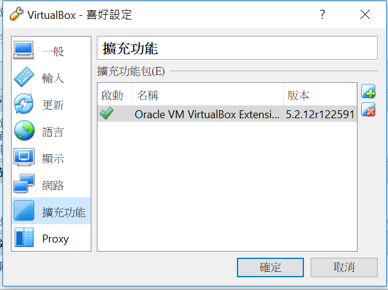
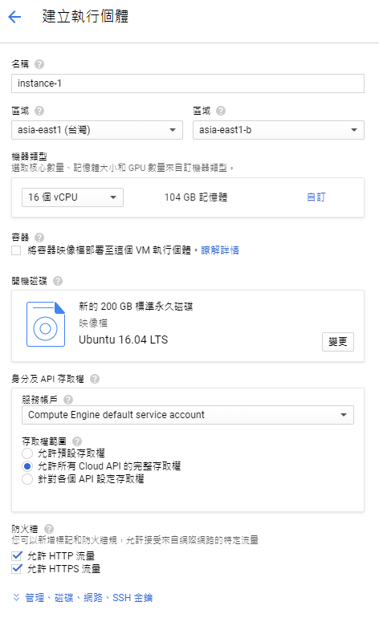
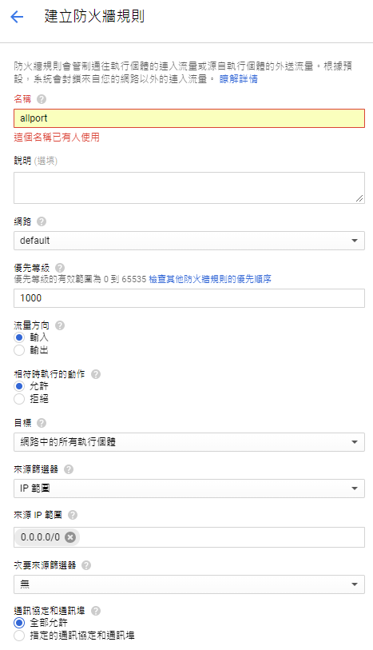

# AiToDinoRun

This reference [playing atari with deep reinforcement learning](https://www.cs.toronto.edu/~vmnih/docs/dqn.pdf)
and use https://blog.paperspace.com/dino-run/ code to play Google Chrome's offline Dino Run game.


Here my aim is practice build up my virtual system environment by myself, and try to understand how to use DRL (Deep Reinforcement Learning) let chrome dino game can start training to get a higher score than human play.

# Installation

First you need clone this repository and you can build up by A+B+C, A+C, B+C or C combination and download [chromedriver](http://chromedriver.chromium.org/downloads) unzip and copy into model folder

```shell=
git clone https://github.com/Anch9999/AiToDinoRun.git
```

### A. Virtualbox + Vagrant
If you don't want dino game training process to occupy all your system resource, I recommend you to use VirtualBox and Vagrant control
your machine. It's very easy to let you adjustment. Also, you can change your CPU cores and memory size by Vagrantfile.
P.S. password : vagrant

**(For Linux)**
If you did not use VirtualBox and Vagrant before, please copy below command to install.

```shell=
sudo apt-get install -y virtualbox vagrant
```

If you ready and you just need to go into Vagrant folder and type below command, and then it is starting to auto-build your virtual machine.
```shell=
vagrant up
```

**(For Windows10)**
1. You need download [Oracle_VM_VirtualBox_Extension_Pack, VirtualBox-5.2.12-122591-Win](http://www.oracle.com/technetwork/server-storage/virtualbox/downloads/index.html) first
and import to extension pack to your virtualbox tool
path -> File -> Preferences



2. Here I use gitbash run as administrator. (right click gitbash icon and you should see this in the popup menu)

3. Go to this repository Vagrant folder and type below command
```shell=
vagrant up
```
P.S. Mention all application you execute in Windows10, you should open by **"run as administrator"** item to avoid some unexpected  error occurs.

### B. GCP VM
By the way, you also can use google cloud platform to build up your virtural machine, in practice, I choose 16 vCPU and 104 GB memory size to be my VM. And next you need to install gui tools and connection by VNC Viewer.



* create new firewall rule in GCP and use ssh connection



```shell=
* sudo apt-get update
* sudo apt-get upgrade
* sudo apt-get install -y ubuntu-desktop gnome-panel gnome-core gnome-settings-daemon metacity nautilus gnome-terminal vnc4server
* vncserver
* type your password
* vim .vnc/xstartup
* copy below lines and paste to file the last line
gnome-panel &
gnome-settings-daemon &
metacity &
nautilus &
* vncserver -kill :1
* vncserver (remember your ip and port, we need use this to your local VNC viewer)
* type your ip and port in VNC viewer, and you should see your ubuntu desktop
```

### C. Use pipenv to crate your virtual environment
Now use pipenv to setup my virtual environment, if you did not use pipenv before please run below command
```shell=
sudo pip install pipenv
```
P.S. If you use my Vagrantfile script and vagrant up, pip should be installed already, otherwise you should install pip first.

And next is start setup
```shell=
pipenv --python 3.6
pipenv shell
cd your_local_AiToDinoRun_path/model
pip install -r requirements.txt (or you can use "pipenv install", but it feels slower than use pip)
jupyer notebook
```

Finally, you can open Reinforcement Learning Dino Run.ipynb to start run your DRP dino game.

Hope you enjoy it :_)

P.S. Invoke init_cache() for the first time.

